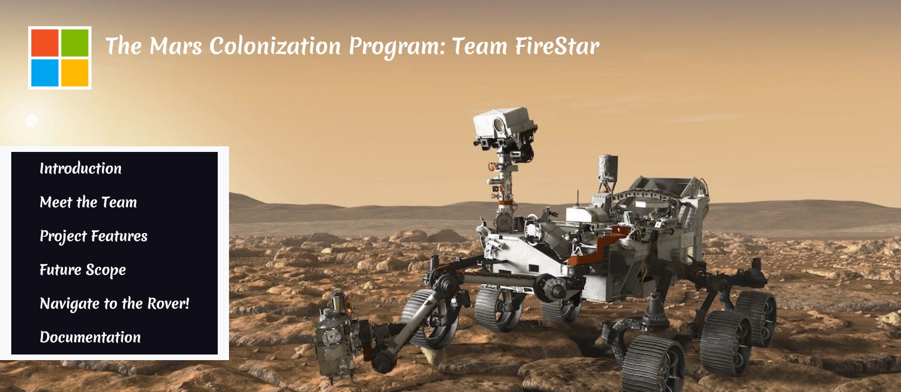

# Navigate the Mars Rover
It is a visualizing tool that helps the Mars Curiosity Rover find the shortest path between a start point and end point while avoiding obstacles on the way by using artificial intelligence search algorithms. The main objective of it is to assist the crew that is chosen to establish a permenant human settlement on Mars, by providing the optimized paths between the start point and the destination point. This project also aims to help the rover achieve its objectives of finding more data about chemical composition, life, etc. on Mars, and for that the rover may need to move from one place to another, as quickly as possible, while avoiding the different obstacles present on mars like- hills, craters, storms etc. Different algorithms are applied to help the rover to become intelligent and move make smart decisions to follow any particular path to reach the destination faster.

**This project is a part of [The Mars Colonization Program](https://microsoft.acehacker.com/mars/) conducted by Microsoft in association with [Ace Hacker](https://www.acehacker.com/).** 

# Complete Documentation
https://drive.google.com/file/d/1fILqTxyzYg-osNQ27anB1GFjAup0m2f1/view

# The Project
https://aayushibansal2001.github.io/Navigate-the-Mars-Rover-Project/

# Contributors
Aayushi Bansal, Srinidhi Ayyagari and Tanisha Sharda

# Acknowledgement
We would like to thank Microsoft for providing the opportunity to learn and develop this project, through Engage 2020 Virtual Mentorship. We would like to thank our mentors Ashwin Bilgi sir, Durgashini ma'am, and Guru Pasupathy sir! 
